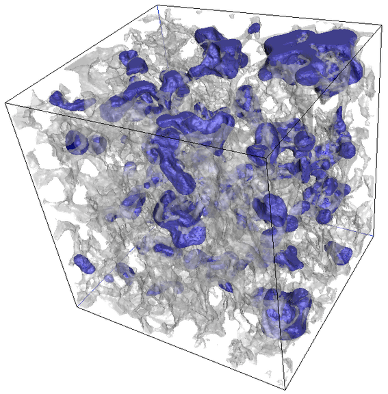

.. DPM_Tools documentation master file, created by
   sphinx-quickstart on Mon Feb 19 10:35:17 2024.
   You can adapt this file completely to your liking, but it should at least
   contain the root `toctree` directive.
.. _front_page:

.. module:: dpm_tools
   :noindex:

|logo| **Digital Porous Media Tools**
=====================================

Welcome to Digital Porous Media (DPM) Tools! Our team at The University of Texas at Austin has put together a collection of Python tools and workflows to help streamline analysis of digital porous media images. 

Our intent is for these tools to be used with `Digital Porous Media Portal <https://https://digitalporousmedia.org/>`_ (formerly Digital Rocks Portal), an excellent source of data! The Portal has undergone significant redesign, and we are excited to unveil it with these integrated tools!

----

Capabilities
############

The Digital Porous Media team is working hard on adding new features and making improvements to this toolbox. So far, DPM Tools is comprised of the following modules:

- ``io``: Tools for obtaining, reading, and writing digital porous media images in a variety of file formats.
- ``metrics``: Functions for quantifying geometric properties of images
- ``segmentation``: Algorithms for classifying phases within an image
- ``visualization``: Workflows for 3D visualization

.. toctree::
   :maxdepth: 2
   :hidden:

   getting-started/index
   modules/index
   tutorials/index

----

Getting Started
###############

The best way to get started is through our :doc:`Getting Started <getting-started/index>` page as well as our :doc:`tutorials <tutorials/general/index>`!

